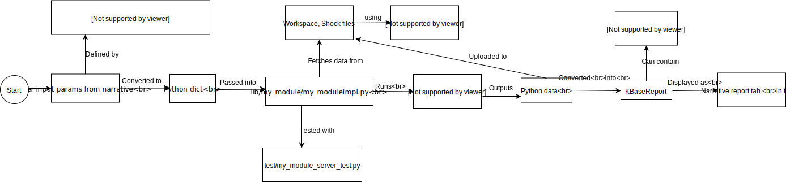

#  [KBase SDK](../README.md)

0. **Overview and Concepts**
1. [Install SDK Dependencies](dependencies.md)
2. [Install SDK with Docker](dockerized_install.md)
3. [Create Module](create_module.md)
4. [Specify Module and Method(s)](edit_module.md)
5. [Implement Method(s)](impl_methods.md)
6. [Specify User Interface](make_ui.md)
7. [Locally Test Module and Method(s)](local_test_module.md)
8. [Register Module](register_module.md)
9. [Test in KBase](test_in_kbase.md)
10. [Complete Module Info](complete_module_info.md)
11. [Deploy](deploy.md)

## SDK Concepts and Overview

Let's start with a high-level overview of how the SDK works and the general concepts involved in making SDK apps.

When a python SDK app runs in a narrative, we typically follow this data path (click to enlarge):

## The Basics

Apps on KBase, such as gene assemblers and annotators that run on narrative pages, are created using the KBase SDK.

When you run an app in a narrative, it runs in a docker container on KBase's servers. You can learn more about docker containers [here](https://www.docker.com/what-container). Docker containers allow you to run compiled programs, such as [MEGAHIT](https://github.com/voutcn/megahit), on any machine.

The starting source code for your app defines the type of input parameters the user can enter, the packages and programs the app will run in its container, and the output it will display in the final report. The source code for your app gets generated using the `kb-sdk` command line utility (see the rest of the tutorial for details).

### Composing apps

Your app can install and use other KBase apps as dependencies, such as [KBParallel](https://github.com/kbaseapps/KBParallel). You can find these apps in github at [https://github.com/kbaseapps](https://github.com/kbaseapps) or in the [KBase app catalog](https://narrative.kbase.us/#catalog/apps) (we will describe these files in later parts of the tutorial).

When you install and run another app within your own, it runs in its own, separate docker container. These SDK apps are also installed and tracked separately from any python dependencies that you install via `pip`.

### Defining your app's parameters

A few configuration files in your app are used to define what parameters your app will accept from the narrative, and what result data your app will return.

The three main configuration files are:

* The KBase Interface Definition Language (KIDL) type specification defines what data types your app can accept as parameters and return as results
* A JSON config file defines the UI elements that your app uses for accepting input from the user
* A YAML config file defines the text labelling and content for your app's UI

The details and locations of these files will be described later in the tutorial.

## Working with files and data

### Scratch

Since SDK apps often run inside multiple docker containers, you have to store files in a special location that all containers have access to: **scratch**. Scratch is usually set to the directory `/kb/module/tmp` running inside your app's docker container and is accessed from a special configuration variable in your app source code. This scratch directory is accessible to your app as long as it's running.

**Scratch is ephemeral** -- any files in the scratch directory are gone when your app stops running. To save files persistently (for example, to use in your report), you need to use **Workspaces**

### The Workspace

The "Workspace" is the term used for the file storage servers used by KBase. For Python SDK apps, you can use apps such as [DataFileUtil](https://github.com/kbaseapps/DataFileUtil), [AssemblyUtil](https://github.com/kbaseapps/AssemblyUtil), and [GenomeFileUtil](https://github.com/kbaseapps/GenomeFileUtil) to download and upload files to the workspace.

The [KBaseReport](https://github.com/kbaseapps/KBaseReport) app is used to generate a final report when your app finishes running, and it also uploads its files onto the workspace servers so that you can see all the report data indefinitely after the app stops running.

## Publishing and testing in the browser

For an app to show up in a real narrative, you need to register it on https://appdev.kbase.us. You can then view and test it in the "Dev" catalog while browsing apps on KBase. Details around this whole process are be described further along in this tutorial.

At this point, you cannot run your app inside a narrative on your own machine; you have to commit changes, publish to github, and re-register your app on https://appdev.kbase.us to test updates inside a narrative.

[\[Next tutorial page\]](dependencies.md) 
[\[Back to top\]](#top) 
[\[Back to steps\]](/README.md#steps)
